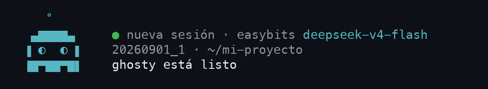

<div align="center">



# ghosty-lite

**Un agente de terminal que cabe en una caja efímera y se expone por WebSocket.**

62 MB · arranca en milisegundos · ACP estándar · MCP · en español

</div>

---

ghosty-lite es un fork de [goose](https://github.com/block/goose) (Apache 2.0) podado y
rebrandeado por [ghosty.studio](https://ghosty.studio). Nació para una necesidad concreta:
correr agentes en **VMs pequeñas y de vida corta, en cualquier nube**, y hablar con ellos
desde un navegador o desde otro agente sin abrir una terminal en la máquina.

Se queda con lo que importa ahí dentro y deja fuera lo que engorda el binario sin servir
headless: el desktop, la inferencia local, el p2p, el dictado. Lo que queda es el loop del
agente, las herramientas, los conectores MCP, los permisos, las recetas y un servidor ACP
listo para producción.

| | goose | ghostycode | **ghosty-lite** |
|---|---|---|---|
| Binario | ~150-200 MB | 71 MB | **62 MB** |
| `serve` hasta responder | — | — | **11 ms** |
| Dependencias (Cargo.lock) | 1,339 | 724 | **955** |
| Servidor | ACP ws + HTTP | HTTP propio + ACP ws | ACP ws + HTTP |
| Onboarding | `goose configure` | fragmentado | `ghosty configure`, en español |
| Estático (musl) | no (V8) | no | **sí** |

## Instalar

```bash
cargo install --git https://github.com/blissito/ghosty-lite goose-cli --bin ghosty
```

Requiere Rust 1.96. Binarios precompilados: pronto.

## Primer uso

```bash
ghosty
```

La primera vez abre el asistente: elige proveedor (EasyBits, DeepSeek, Anthropic, OpenAI,
Ollama u otro de los 40 que trae), pega la llave, prueba la conexión en vivo y te deja en el
chat. Con EasyBits, una sola llave sirve para el modelo y para su MCP de +100 herramientas.

```bash
ghosty configure   # volver al asistente: proveedores, extensiones, servidor, ajustes
ghosty doctor      # comprobar proveedor, extensiones y rutas
ghosty info        # qué está configurado y dónde
```

Dentro del chat: `/help`, `/mode`, `/model`, `/extension`, `/plan`, `/compact`, `/skills`.

## Como servidor

Es la razón de este proyecto.

```bash
ghosty serve --setup   # genera el token, elige host, puerto y orígenes; imprime cómo conectar
ghosty serve           # ACP por WebSocket y streamable HTTP en /acp, salud en /health
ghosty serve --check   # ¿puede arrancar tal como está?
```

```
👻  Servidor listo.

  HTTP / WS:    http://127.0.0.1:3284/acp   ·   ws://127.0.0.1:3284/acp
  Salud:        curl http://127.0.0.1:3284/health

  Desde el navegador:
    new WebSocket("ws://127.0.0.1:3284/acp?token=ghl-…")
```

Habla [ACP](https://agentclientprotocol.com) estándar, así que cualquier cliente ACP
(Zed, JetBrains, el tuyo) se conecta igual: `initialize` → `session/new` → `session/prompt`,
y recibe `session/update` mientras trabaja. Varios clientes a la vez, sesiones en SQLite,
`session/load` para retomar. Conserva el namespace `_goose/unstable/*` para que los
clientes que ya existen sigan funcionando.

Tres cosas antes de exponerlo:

- Sin `GHOSTY_SERVER_TOKEN` no arranca (salvo `--dangerously-unauthenticated`). Los
  clientes lo mandan en `X-Secret-Key` o, desde un navegador, en `?token=`.
- `--allowed-origin` **reemplaza** los orígenes por defecto (loopback). Una página servida
  desde otro origen necesita el suyo en la lista o recibe 403 en el upgrade.
- `/health` y `/status` responden sin token. TLS conviene terminarlo en el balanceador.

## En una VM o contenedor

```bash
docker build -t ghosty-lite .
docker run -p 3284:3284 \
  -e GHOSTY_SERVER_TOKEN=ghl-… \
  -e EASYBITS_API_KEY=… \
  -v datos:/data \
  ghosty-lite
```

La imagen es un binario estático (musl) sobre `debian-slim` con `git` y `curl`. Corre
`ghosty serve --host 0.0.0.0` como usuario sin privilegios, guarda config y sesiones en
`/data` y no usa el keyring del sistema. Todo el estado está en ese volumen: sin él, la
caja nace limpia cada vez, que es justo lo que una caja efímera quiere.

## Qué sabe hacer

- **Herramientas**: shell, editor de archivos, análisis de código (tree-sitter), memoria,
  lista de pendientes, subagentes, control del escritorio.
- **MCP**: extensiones stdio y streamable HTTP, con OAuth. Se agregan desde `ghosty
  configure` o por ACP en cada sesión.
- **Permisos**: modo `auto`, `approve`, `smart_approve` (un modelo decide qué es mutación)
  o `chat` (sin herramientas), y reglas por herramienta.
- **Recetas**: YAML con instrucciones, extensiones, parámetros y sub-recetas; se lanzan
  con `ghosty run --recipe` o por el scheduler cron incorporado.
- **Contexto**: compactación automática al acercarse al límite; `/compact` a mano.
- **Skills y hooks**: directorios `skills/` y ganchos en el ciclo del agente.

## Configuración

Vive en `~/.ghosty-lite/` o donde apunte `GHOSTY_PATH_ROOT`. Cada clave es también una
variable de entorno con el mismo nombre, y el entorno gana:

| Clave | Qué |
|---|---|
| `GHOSTY_PROVIDER`, `GHOSTY_MODEL` | proveedor y modelo activos |
| `GHOSTY_MODE` | `auto` · `approve` · `smart_approve` · `chat` |
| `GHOSTY_SERVER_TOKEN` | token de `serve` |
| `GHOSTY_SERVE_HOST`, `GHOSTY_SERVE_PORT`, `GHOSTY_SERVE_ALLOWED_ORIGINS` | lo que guarda `serve --setup` |
| `GHOSTY_DISABLE_KEYRING` | secretos en archivo, no en el keyring (contenedores) |
| `GHOSTY_DISABLE_SESSION_NAMING` | sin la llamada extra que titula la sesión |
| `GHOSTY_TELEMETRY=0` | apaga la telemetría en esta ejecución |

Las variables `GOOSE_*` de una instalación de goose se siguen leyendo, y un `config.yaml`
de goose se migra solo.

## Telemetría

Cuenta versión, sistema, duración y desenlace de la sesión, y contadores de uso y de
errores. Nunca conversaciones, código, prompts, archivos ni credenciales. Lo dice al primer
arranque y se apaga con `GHOSTY_TELEMETRY=0` o desde `ghosty configure` → Ajustes →
Telemetría. Esquema completo en `crates/ghosty-telemetry/docs/TELEMETRY.md`.

## Qué se quitó y por qué

Inferencia local (llama.cpp), roaming p2p, dictado, gateway de Telegram, Goose Apps,
autovisualiser, self-update, PostHog y V8. La lista con motivos está en
[`CHANGES-FROM-UPSTREAM.md`](CHANGES-FROM-UPSTREAM.md). El *code mode* (el modelo escribe
un programa que encadena herramientas) sigue disponible compilando con `--features
code-mode`; la versión ligera con QuickJS está en el mapa.

## Desarrollo

```bash
just check    # cargo check --workspace
just lint     # fmt + clippy -D warnings
just test     # cargo test --workspace
just release  # target/release/ghosty
scripts/acp-smoke.py target/release/ghosty   # humo del servidor por WebSocket
```

Identificadores en inglés; comentarios, commits y copy en español. Más en
[`AGENTS.md`](AGENTS.md) y [`CONTRIBUTING.md`](CONTRIBUTING.md).

## Licencia

Apache 2.0. ghosty-lite es una versión modificada de goose, Copyright Block, Inc. y los
contribuidores de la Agentic AI Foundation. Ver [`LICENSE`](LICENSE), [`NOTICE`](NOTICE) y
[`THIRD_PARTY_NOTICES.md`](THIRD_PARTY_NOTICES.md). El fantasma viene de
[ghostycode](https://github.com/blissito/ghostycode).
